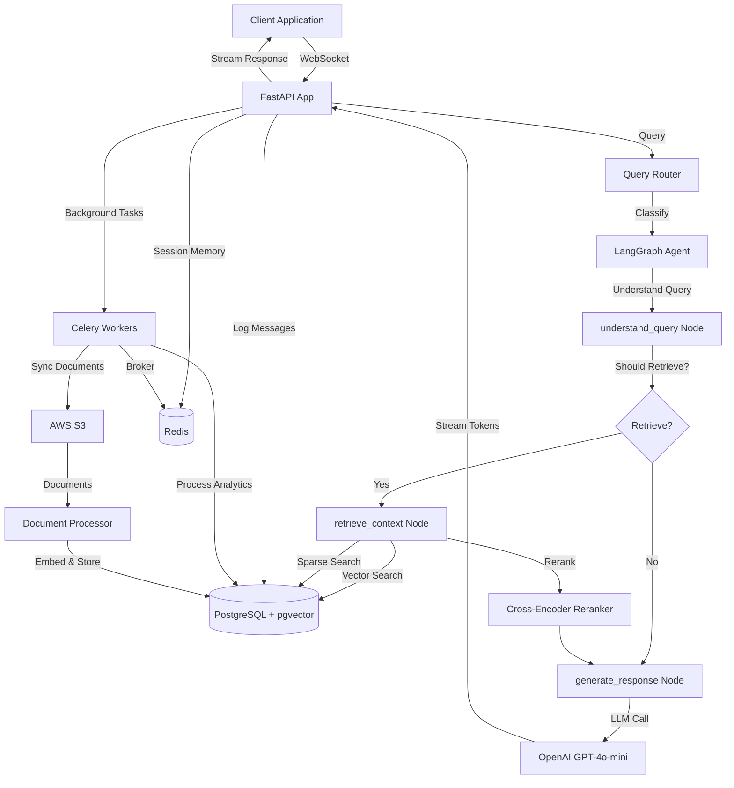
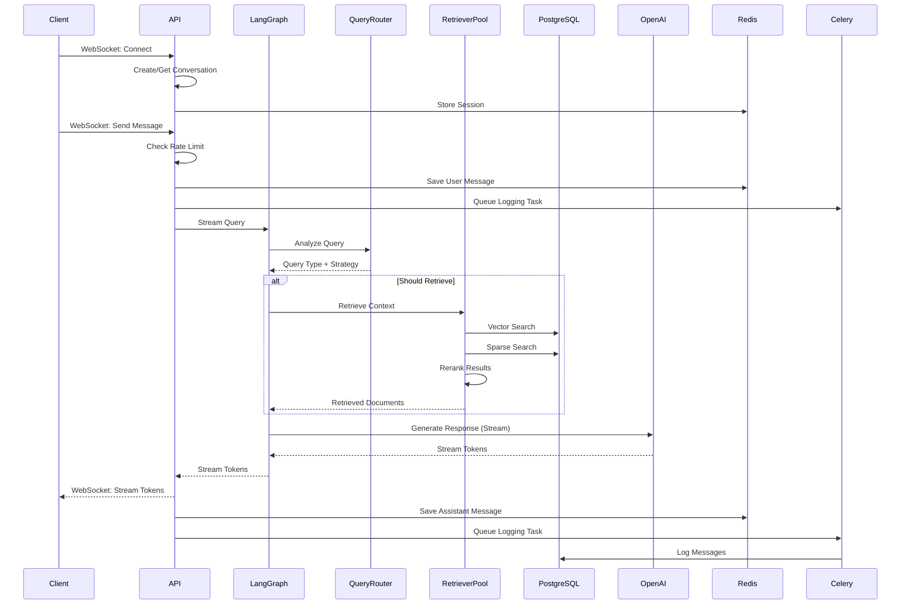
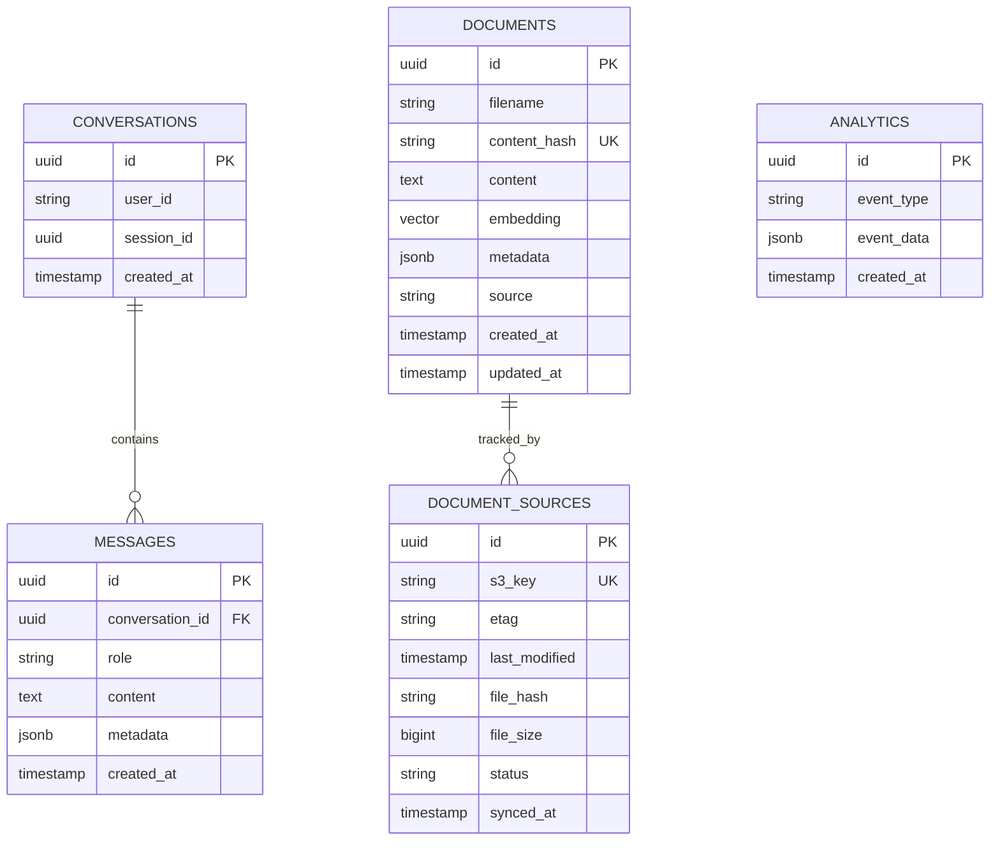

# 🤖 RAG Profile Agent

> An intelligent, production-ready RAG (Retrieval-Augmented Generation) system powered by LangGraph, FastAPI, and OpenAI. Transform documents into a conversational AI assistant that answers questions about a professional profile with precision and context awareness.

[](https://www.python.org/)
[](https://fastapi.tiangolo.com/)
[](https://www.postgresql.org/)
[](LICENSE)
[](tests/)

---

## 📑 Table of Contents

- [Overview](#overview)
- [Demo](#demo)
- [Tech Stack](#tech-stack)
- [Architecture](#architecture)
- [Getting Started](#getting-started)
  - [Prerequisites](#prerequisites)
  - [Installation](#installation)
  - [Environment Variables](#environment-variables)
- [Usage](#usage)
- [Project Structure](#project-structure)
- [API Documentation](#api-documentation)
- [Database Schema](#database-schema)
- [Features](#features)
- [Testing](#testing)
- [Deployment](#deployment)
- [Contributing](#contributing)
- [License](#license)

---

## 🎯 Overview

RAG Profile Agent is a sophisticated document-based conversational AI system designed to answer questions about a professional profile. Built with modern RAG (Retrieval-Augmented Generation) techniques, it combines vector search, hybrid retrieval strategies, and intelligent query routing to provide accurate, context-aware responses.

### Problem It Solves

Traditional chatbots lack context and often provide generic responses. This system solves that by:
- **Grounding responses in actual documents** - All answers are derived from uploaded profile documents (resume, project descriptions, etc.)
- **Intelligent query understanding** - Classifies queries (greetings, out-of-scope, factual Q&A) and routes them appropriately
- **Hybrid retrieval** - Combines dense vector search and sparse keyword search for optimal relevance
- **Real-time streaming** - Provides token-by-token responses via WebSocket for better UX
- **Production-ready** - Includes rate limiting, error handling, metrics collection, and background task processing

### Key Features

- 🔍 **Modular RAG Architecture** - Pluggable retrieval strategies (dense, sparse, hybrid, multi-hop, HyDE)
- 🎯 **Query Routing** - Intelligent query classification and strategy selection
- 🔄 **LangGraph Workflow** - Agent-based orchestration with conditional routing
- 💬 **Real-time Streaming** - WebSocket-based token streaming for responsive UX
- 📊 **Advanced Retrieval** - Hybrid search with reranking for better accuracy
- 🔒 **Rate Limiting** - Session-based rate limiting (5 messages per 6 hours)
- 📈 **Performance Metrics** - Comprehensive tracking (retrieval time, LLM time, TTFB)
- 🗄️ **Dual Storage** - PostgreSQL for persistence, Redis for fast session memory
- ☁️ **S3 Integration** - Automatic document synchronization from AWS S3
- 🧪 **Comprehensive Testing** - 38 tests covering unit and integration scenarios

### Target Audience

- **Developers** building document-based AI assistants
- **Recruiters/HR** needing AI-powered profile search
- **Job seekers** wanting intelligent portfolio assistants
- **AI/ML Engineers** interested in production RAG systems

---

## 🎬 Demo

> 📸 **Screenshots Placeholder**: Add screenshots of:
> - WebSocket chat interface
> - API documentation (Swagger UI)
> - Flower dashboard (Celery monitoring)
> - Vector search visualization (optional)

> 🎥 **Video Walkthrough**: Add link to demo video showcasing:
> - Document upload process
> - Real-time chat interaction
> - Query routing and retrieval process
> - Admin/monitoring dashboards

> 🌐 **Live Demo**: [Add live demo link if available]

---

## 🛠️ Tech Stack

### Backend Framework
| Technology | Version | Purpose |
|------------|---------|---------|
| **FastAPI** | 0.109.0 | Modern, fast web framework for APIs |
| **Uvicorn** | 0.27.0 | ASGI server with WebSocket support |
| **Python** | 3.12+ | Programming language |

### AI/ML Framework
| Technology | Version | Purpose |
|------------|---------|---------|
| **LangChain** | 0.3.13 | LLM application framework |
| **LangGraph** | 0.2.60 | Agent workflow orchestration |
| **LangChain OpenAI** | 0.2.14 | OpenAI integration |
| **OpenAI API** | Latest | GPT-4o-mini & text-embedding-3-small |
| **Sentence Transformers** | ≥2.7.0 | Cross-encoder reranking |

### Database & Storage
| Technology | Version | Purpose |
|------------|---------|---------|
| **PostgreSQL** | 16+ | Primary relational database |
| **pgvector** | 0.2.4 | Vector similarity search extension |
| **Redis** | 7+ | Session memory & caching |
| **AWS S3** | Latest | Document storage |

### Task Queue & Background Jobs
| Technology | Version | Purpose |
|------------|---------|---------|
| **Celery** | 5.3.6 | Distributed task queue |
| **Flower** | 2.0.1 | Celery monitoring dashboard |

### Data Processing
| Technology | Version | Purpose |
|------------|---------|---------|
| **PyPDF** | 4.0.0 | PDF document parsing |
| **python-docx** | 1.1.0 | Word document parsing |
| **python-magic** | 0.4.27 | File type detection |

### DevOps & Infrastructure
| Technology | Version | Purpose |
|------------|---------|---------|
| **Docker** | Latest | Containerization |
| **Docker Compose** | Latest | Multi-container orchestration |
| **Alembic** | 1.13.1 | Database migrations |
| **boto3** | 1.34.34 | AWS SDK for S3 integration |

### Testing & Quality
| Technology | Version | Purpose |
|------------|---------|---------|
| **pytest** | 7.4.4 | Testing framework |
| **pytest-asyncio** | 0.23.3 | Async test support |
| **pytest-cov** | 4.1.0 | Coverage reporting |
| **pytest-mock** | 3.12.0 | Mocking utilities |
| **httpx** | 0.26.0 | Async HTTP client for testing |

### Security & Validation
| Technology | Version | Purpose |
|------------|---------|---------|
| **python-jose** | 3.3.0 | JWT token handling |
| **passlib** | 1.7.4 | Password hashing |
| **pydantic** | ≥2.7.4 | Data validation |

---

## 🏗️ Architecture

### System Architecture Diagram



### Folder Structure

```
rag-profile-agent/
├── app/                          # Main application package
│   ├── __init__.py
│   ├── main.py                   # FastAPI application entry point
│   │
│   ├── api/                      # API endpoints
│   │   ├── __init__.py
│   │   ├── deps.py               # Dependency injection
│   │   └── v1/                   # API version 1
│   │       ├── __init__.py
│   │       ├── chat.py           # WebSocket chat endpoint
│   │       ├── documents.py      # Document management endpoints
│   │       └── health.py         # Health check endpoints
│   │
│   ├── core/                     # Core configuration
│   │   ├── __init__.py
│   │   ├── config.py             # Settings & environment variables
│   │   ├── database.py           # Database connection & session management
│   │   ├── metrics.py            # Performance metrics collection
│   │   ├── middleware.py         # Custom middleware
│   │   └── security.py           # Security utilities
│   │
│   ├── models/                   # SQLAlchemy ORM models
│   │   ├── __init__.py
│   │   ├── conversation.py       # Conversation & Message models
│   │   ├── document.py           # Document model with vector embeddings
│   │   └── document_source.py    # Document source tracking
│   │
│   ├── schemas/                  # Pydantic schemas
│   │   ├── __init__.py
│   │   ├── chat.py               # Chat request/response schemas
│   │   └── document.py           # Document schemas
│   │
│   ├── services/                 # Business logic services
│   │   ├── __init__.py
│   │   ├── cache.py              # Caching utilities
│   │   ├── document_processor.py # Document processing & embedding
│   │   ├── grounding.py          # Answer grounding & validation
│   │   ├── llm.py                # LLM service wrapper
│   │   ├── memory.py             # Conversation memory management
│   │   ├── rate_limiter.py       # Session-based rate limiting
│   │   ├── redis_memory.py       # Redis session memory service
│   │   ├── vector_store.py       # Vector store service
│   │   │
│   │   ├── langgraph/            # LangGraph agent components
│   │   │   ├── __init__.py
│   │   │   ├── agent.py          # RAGAgent class & graph builder
│   │   │   ├── nodes.py          # Graph nodes (understand, retrieve, generate)
│   │   │   ├── state.py          # Agent state definition
│   │   │   ├── streaming_callback.py  # Streaming callback handler
│   │   │   └── tools.py          # LangGraph tools
│   │   │
│   │   └── modular_rag/          # Modular RAG components
│   │       ├── __init__.py
│   │       ├── compressor.py     # Context compression
│   │       ├── multi_hop.py      # Multi-hop retrieval
│   │       ├── query_router.py   # Query classification & routing
│   │       ├── reranker.py       # Cross-encoder reranking
│   │       ├── retriever_pool.py # Retrieval strategy manager
│   │       ├── task_adapter.py   # Task-specific LLM configuration
│   │       ├── validator.py      # Answer validation
│   │       │
│   │       ├── memory/           # Enhanced memory components
│   │       │   ├── enhanced_memory.py
│   │       │   └── entity_tracker.py
│   │       │
│   │       └── retrievers/       # Retrieval strategies
│   │           ├── dense_retriever.py    # Dense vector retrieval
│   │           ├── sparse_retriever.py   # Sparse keyword retrieval
│   │           ├── hybrid_retriever.py   # Hybrid (dense + sparse)
│   │           ├── hyde_retriever.py     # HyDE retrieval
│   │           └── fusion.py             # Result fusion algorithms
│   │
│   ├── tasks/                    # Celery background tasks
│   │   ├── __init__.py
│   │   ├── celery_app.py         # Celery application configuration
│   │   ├── analytics.py          # Analytics event logging
│   │   ├── conversation_logging.py  # Message logging to PostgreSQL
│   │   └── document_sync.py      # S3 document synchronization
│   │
│   └── utils/                    # Utility functions
│       └── __init__.py
│
├── docker/                       # Docker configurations
│   ├── Dockerfile.app            # Application container
│   └── Dockerfile.worker         # Celery worker container
│
├── scripts/                      # Utility scripts
│   ├── init_db.py                # Database initialization
│   ├── init_db.sql               # SQL schema initialization
│   ├── setup_postgres.sh         # PostgreSQL setup script
│   ├── setup_redis.sh            # Redis setup script
│   ├── add_test_document.py      # Add test documents
│   ├── delete_document.py        # Delete documents
│   └── view_synced_documents.py  # View synced documents
│
├── tests/                        # Test suites
│   ├── __init__.py
│   ├── conftest.py               # Pytest fixtures
│   ├── README.md                 # Test documentation
│   ├── unit/                     # Unit tests
│   │   ├── test_rate_limiter.py
│   │   ├── test_redis_memory.py
│   │   ├── test_health_endpoint.py
│   │   ├── test_config.py
│   │   ├── test_query_router.py
│   │   ├── test_metrics.py
│   │   └── test_celery_tasks.py
│   └── integration/              # Integration tests
│       └── test_websocket_chat.py
│
├── alembic/                      # Database migrations
│   └── versions/                 # Migration versions
│
├── docker-compose.yml            # Docker Compose configuration
├── requirements.txt              # Python dependencies
├── pytest.ini                    # Pytest configuration
├── .gitignore                    # Git ignore patterns
│
└── README.md                     # This file
```

### Data Flow



---

## 🚀 Getting Started

### Prerequisites

#### Required Software

| Software | Version | Purpose |
|----------|---------|---------|
| **Python** | 3.12+ | Runtime environment |
| **PostgreSQL** | 16+ | Database with pgvector extension |
| **Redis** | 7+ | Cache and message broker |
| **Docker** (optional) | Latest | Containerization |
| **Docker Compose** (optional) | Latest | Multi-container orchestration |

#### Operating System

- ✅ Linux (Ubuntu 20.04+, Debian 11+)
- ✅ macOS (10.15+)
- ✅ Windows (WSL2 recommended)

#### Required Accounts & API Keys

- **OpenAI API Key** - For LLM and embeddings ([Get one here](https://platform.openai.com/api-keys))
- **AWS Account** (optional) - For S3 document storage
  - AWS Access Key ID
  - AWS Secret Access Key
  - S3 Bucket name

### Installation

#### Option 1: Docker (Recommended for Quick Start)

1. **Clone the repository**:
   ```bash
   git clone https://github.com/yourusername/rag-profile-agent.git
   cd rag-profile-agent
   ```

2. **Create environment file**:
   ```bash
   cp .env.example .env
   # Edit .env and add your API keys (OPENAI_API_KEY, AWS credentials)
   ```

3. **Start all services**:
   ```bash
   docker-compose up -d
   ```

   This starts:
   - PostgreSQL with pgvector (port 5432)
   - Redis (port 6379)
   - FastAPI application (port 8000)
   - Celery worker
   - Celery beat scheduler
   - Flower dashboard (port 5555)

4. **Initialize database** (if not auto-initialized):
   ```bash
   docker-compose exec app python scripts/init_db.py
   ```

5. **Verify installation**:
   ```bash
   curl http://localhost:8000/
   # Should return: {"message": "RAG Profile Agent API", ...}
   ```

#### Option 2: Local Development Setup

1. **Clone the repository**:
   ```bash
   git clone https://github.com/yourusername/rag-profile-agent.git
   cd rag-profile-agent
   ```

2. **Create and activate virtual environment**:
   ```bash
   python3.12 -m venv venv
   source venv/bin/activate  # On Windows: venv\Scripts\activate
   ```

3. **Install dependencies**:
   ```bash
   pip install --upgrade pip
   pip install -r requirements.txt
   ```

4. **Set up PostgreSQL**:
   ```bash
   # Install PostgreSQL 16+ with pgvector extension
   # Ubuntu/Debian:
   sudo apt-get install postgresql-16 postgresql-contrib-16
   
   # macOS (Homebrew):
   brew install postgresql@16
   
   # Run setup script (creates database and user):
   sudo ./scripts/setup_postgres.sh
   ```

5. **Set up Redis**:
   ```bash
   # Ubuntu/Debian:
   sudo apt-get install redis-server
   
   # macOS (Homebrew):
   brew install redis
   
   # Run setup script:
   sudo ./scripts/setup_redis.sh
   
   # Start Redis:
   redis-server  # or: brew services start redis
   ```

6. **Create environment file**:
   ```bash
   cp .env.example .env
   # Edit .env and configure:
   # - OPENAI_API_KEY (required)
   # - Database credentials
   # - Redis credentials
   # - AWS credentials (optional, for S3)
   ```

7. **Initialize database**:
   ```bash
   python scripts/init_db.py
   ```

8. **Start the application**:

   **Terminal 1 - FastAPI Server**:
   ```bash
   uvicorn app.main:app --reload --host 0.0.0.0 --port 8000
   ```

   **Terminal 2 - Celery Worker**:
   ```bash
   celery -A app.tasks.celery_app worker --loglevel=info
   ```

   **Terminal 3 - Celery Beat (Optional, for scheduled tasks)**:
   ```bash
   celery -A app.tasks.celery_app beat --loglevel=info
   ```

   **Terminal 4 - Flower (Optional, for monitoring)**:
   ```bash
   celery -A app.tasks.celery_app flower --port=5555
   ```

9. **Verify installation**:
   ```bash
   # Check API health
   curl http://localhost:8000/v1/health/
   
   # Check API documentation
   open http://localhost:8000/docs
   ```

### Environment Variables

Create a `.env` file in the project root with the following variables:

| Variable | Required | Description | Example |
|----------|----------|-------------|---------|
| **OPENAI_API_KEY** | ✅ Yes | OpenAI API key for LLM and embeddings | `sk-...` |
| **POSTGRES_HOST** | ✅ Yes | PostgreSQL host | `localhost` or `postgres` (Docker) |
| **POSTGRES_PORT** | ✅ Yes | PostgreSQL port | `5432` |
| **POSTGRES_DB** | ✅ Yes | Database name | `profile_agent` |
| **POSTGRES_USER** | ✅ Yes | PostgreSQL username | `postgres` |
| **POSTGRES_PASSWORD** | ✅ Yes | PostgreSQL password | `your_password` |
| **REDIS_HOST** | ✅ Yes | Redis host | `localhost` or `redis` (Docker) |
| **REDIS_PORT** | ✅ Yes | Redis port | `6379` |
| **REDIS_DB** | ✅ Yes | Redis database number | `0` |
| **CELERY_BROKER_URL** | ✅ Yes | Celery broker URL | `redis://localhost:6379/0` |
| **CELERY_RESULT_BACKEND** | ✅ Yes | Celery result backend | `redis://localhost:6379/1` |
| **AWS_ACCESS_KEY_ID** | ⚠️ Optional | AWS access key for S3 | `AKIA...` |
| **AWS_SECRET_ACCESS_KEY** | ⚠️ Optional | AWS secret key for S3 | `...` |
| **S3_BUCKET** | ⚠️ Optional | S3 bucket name | `profile-documents` |
| **S3_REGION** | ⚠️ Optional | AWS region | `us-east-1` |
| **LANGCHAIN_API_KEY** | ⚠️ Optional | LangSmith API key for tracing | `lsv2_...` |
| **LANGCHAIN_PROJECT** | ⚠️ Optional | LangSmith project name | `rag-profile-agent` |
| **SECRET_KEY** | ⚠️ Optional | Application secret key | `your-secret-key` |
| **ENVIRONMENT** | ⚠️ Optional | Environment (development/production) | `development` |
| **DEBUG** | ⚠️ Optional | Enable debug mode | `True` |

**Example `.env` file**:
```env
# OpenAI
OPENAI_API_KEY=sk-your-openai-api-key-here

# Database
POSTGRES_HOST=localhost
POSTGRES_PORT=5432
POSTGRES_DB=profile_agent
POSTGRES_USER=postgres
POSTGRES_PASSWORD=your_password

# Redis
REDIS_HOST=localhost
REDIS_PORT=6379
REDIS_DB=0

# Celery
CELERY_BROKER_URL=redis://localhost:6379/0
CELERY_RESULT_BACKEND=redis://localhost:6379/1

# AWS S3 (Optional)
AWS_ACCESS_KEY_ID=your-access-key
AWS_SECRET_ACCESS_KEY=your-secret-key
S3_BUCKET=profile-documents
S3_REGION=us-east-1

# LangSmith (Optional)
LANGCHAIN_API_KEY=lsv2_your-key
LANGCHAIN_PROJECT=rag-profile-agent

# App Config
ENVIRONMENT=development
DEBUG=True
SECRET_KEY=your-secret-key-here
```

---

## 💻 Usage

### WebSocket Chat API

Connect to the WebSocket endpoint for real-time streaming responses:

```javascript
// JavaScript/TypeScript Example
const ws = new WebSocket('ws://localhost:8000/v1/ws/chat');

// Send handshake
ws.onopen = () => {
  ws.send(JSON.stringify({
    user_id: 'user-123',
    session_id: 'session-456',
    message: 'What is Azim\'s education background?' // Optional initial message
  }));
};

// Receive streaming tokens
ws.onmessage = (event) => {
  const data = JSON.parse(event.data);
  
  if (data.type === 'stream') {
    // Append token to UI
    console.log('Token:', data.content);
  } else if (data.type === 'error') {
    console.error('Error:', data.message);
  } else if (data.type === 'complete') {
    console.log('Complete response:', data.content);
  }
};

// Send additional messages
ws.send(JSON.stringify({
  message: 'Tell me about his projects'
}));
```

### REST API Examples

#### Health Check
```bash
curl http://localhost:8000/v1/health/
```

#### List Documents
```bash
curl http://localhost:8000/v1/documents/
```

#### Upload Document (if implemented)
```bash
curl -X POST http://localhost:8000/v1/documents/ \
  -F "file=@resume.pdf"
```

### Python Client Example

```python
import asyncio
import websockets
import json

async def chat_with_agent():
    uri = "ws://localhost:8000/v1/ws/chat"
    async with websockets.connect(uri) as websocket:
        # Send handshake
        await websocket.send(json.dumps({
            "user_id": "python-client",
            "session_id": "session-123",
            "message": "What is Azim's education?"
        }))
        
        # Receive streaming response
        full_response = ""
        async for message in websocket:
            data = json.loads(message)
            if data.get("type") == "stream":
                full_response += data["content"]
                print(data["content"], end="", flush=True)
            elif data.get("type") == "complete":
                print(f"\n\nComplete: {data['content']}")
                break
            elif data.get("type") == "error":
                print(f"\nError: {data['message']}")
                break

asyncio.run(chat_with_agent())
```

### Common Use Cases

1. **Ask about education**:
   ```
   "What is Azim's education background?"
   ```

2. **Ask about projects**:
   ```
   "Tell me about projects Azim worked on"
   ```

3. **Ask about skills**:
   ```
   "What technologies does Azim know?"
   ```

4. **Greetings** (automatically handled without RAG):
   ```
   "Hello" → Gets friendly greeting response
   ```

5. **Out-of-scope questions** (automatically redirected):
   ```
   "What's the weather?" → Gets polite redirect message
   ```

---

## 📂 Project Structure

See [Architecture > Folder Structure](#folder-structure) section above for detailed structure.

### Key Directories Explained

- **`app/api/`** - FastAPI route handlers and endpoints
- **`app/core/`** - Core configuration, database, middleware
- **`app/models/`** - SQLAlchemy ORM models (database schema)
- **`app/schemas/`** - Pydantic validation schemas
- **`app/services/`** - Business logic and service layer
  - **`langgraph/`** - LangGraph agent workflow components
  - **`modular_rag/`** - Modular RAG retrieval components
- **`app/tasks/`** - Celery background tasks
- **`tests/`** - Test suites (unit and integration)
- **`scripts/`** - Utility scripts for setup and administration

---

## 📡 API Documentation

### Interactive Documentation

Once the server is running, visit:
- **Swagger UI**: http://localhost:8000/docs
- **ReDoc**: http://localhost:8000/redoc

### Endpoints

#### WebSocket Endpoints

##### `WS /v1/ws/chat`

Real-time chat endpoint with streaming responses.

**Connection**:
```javascript
ws://localhost:8000/v1/ws/chat
```

**Handshake Message** (required on connect):
```json
{
  "user_id": "string",
  "session_id": "string (UUID)",
  "message": "string (optional initial message)"
}
```

**Client Messages**:
```json
{
  "message": "Your question here"
}
```

**Server Responses**:

1. **Streaming Token**:
   ```json
   {
     "type": "stream",
     "content": "token"
   }
   ```

2. **Complete Response**:
   ```json
   {
     "type": "complete",
     "content": "Full response text",
     "metadata": {
       "retrieved_docs_count": 3,
       "query_type": "factual_qa"
     }
   }
   ```

3. **Error Response**:
   ```json
   {
     "type": "error",
     "message": "Error description",
     "error_code": "rate_limit_exceeded",
     "retry_after_seconds": 21600
   }
   ```

**Rate Limiting**: 5 messages per session per 6 hours

#### REST Endpoints

##### `GET /`

Root endpoint with API information.

**Response**:
```json
{
  "message": "RAG Profile Agent API",
  "environment": "development",
  "database": "localhost",
  "docs": "/docs",
  "health": "/health"
}
```

##### `GET /v1/health/`

Basic health check.

**Response**:
```json
{
  "status": "healthy",
  "timestamp": "2024-01-01T00:00:00"
}
```

##### `GET /v1/health/live`

Liveness probe for Kubernetes/Docker.

**Response**:
```json
{
  "status": "alive",
  "timestamp": "2024-01-01T00:00:00"
}
```

##### `GET /v1/health/ready`

Readiness probe (checks database/Redis connectivity).

**Response**:
```json
{
  "status": "ready",
  "timestamp": "2024-01-01T00:00:00"
}
```

##### `GET /v1/documents/`

List all documents (if implemented).

**Response**:
```json
{
  "documents": [
    {
      "id": "uuid",
      "filename": "resume.pdf",
      "created_at": "2024-01-01T00:00:00"
    }
  ]
}
```

##### `POST /v1/documents/`

Upload a document (if implemented).

**Request**: Multipart form data with `file` field

**Response**:
```json
{
  "id": "uuid",
  "filename": "resume.pdf",
  "status": "processing"
}
```

---

## 🗄️ Database Schema

### Entity Relationship Diagram



### Tables

#### `conversations`

Stores conversation sessions.

| Column | Type | Description |
|--------|------|-------------|
| `id` | UUID | Primary key |
| `user_id` | VARCHAR(255) | User identifier |
| `session_id` | UUID | Session identifier (indexed) |
| `created_at` | TIMESTAMP | Creation timestamp |

#### `messages`

Stores individual messages in conversations.

| Column | Type | Description |
|--------|------|-------------|
| `id` | UUID | Primary key |
| `conversation_id` | UUID | Foreign key to conversations |
| `role` | VARCHAR(20) | Message role (user/assistant/system) |
| `content` | TEXT | Message content |
| `metadata` | JSONB | Additional metadata |
| `created_at` | TIMESTAMP | Creation timestamp |

#### `documents`

Stores document content with vector embeddings.

| Column | Type | Description |
|--------|------|-------------|
| `id` | UUID | Primary key |
| `filename` | VARCHAR(255) | Original filename |
| `content_hash` | VARCHAR(64) | Content hash (unique, indexed) |
| `content` | TEXT | Document text content |
| `embedding` | VECTOR(1536) | OpenAI embedding vector (indexed with HNSW) |
| `metadata` | JSONB | Document metadata (GIN indexed) |
| `source` | VARCHAR(50) | Source (e.g., 's3') |
| `created_at` | TIMESTAMP | Creation timestamp |
| `updated_at` | TIMESTAMP | Last update timestamp |

**Indexes**:
- `documents_embedding_idx` - HNSW index for vector similarity search
- `idx_documents_content_fts` - GIN index for full-text search
- `idx_documents_metadata_gin` - GIN index for JSONB queries

#### `document_sources`

Tracks document sources for incremental synchronization.

| Column | Type | Description |
|--------|------|-------------|
| `id` | UUID | Primary key |
| `s3_key` | VARCHAR(255) | S3 object key (unique, indexed) |
| `etag` | VARCHAR(64) | S3 ETag |
| `last_modified` | TIMESTAMP | Last modification time |
| `file_hash` | VARCHAR(64) | File content hash |
| `file_size` | BIGINT | File size in bytes |
| `status` | VARCHAR(20) | Status (synced/pending/failed/processing) |
| `synced_at` | TIMESTAMP | Synchronization timestamp |

#### `analytics`

Stores analytics events (populated by Celery tasks).

| Column | Type | Description |
|--------|------|-------------|
| `id` | UUID | Primary key |
| `event_type` | VARCHAR(50) | Event type |
| `event_data` | JSONB | Event data |
| `created_at` | TIMESTAMP | Creation timestamp |

---

## ✨ Features

### ✅ Implemented Features

- ✅ **Modular RAG Architecture** - Pluggable retrieval strategies
- ✅ **Query Routing** - Intelligent query classification (greeting, out-of-scope, factual Q&A)
- ✅ **Hybrid Retrieval** - Dense + sparse search with RRF fusion
- ✅ **Cross-Encoder Reranking** - Improves retrieval relevance
- ✅ **Real-time Streaming** - WebSocket token streaming
- ✅ **Session-Based Rate Limiting** - 5 messages per 6 hours per session
- ✅ **Performance Metrics** - Tracks retrieval time, LLM time, TTFB
- ✅ **Redis Session Memory** - Fast conversation context storage
- ✅ **PostgreSQL Persistence** - Long-term message and document storage
- ✅ **S3 Document Sync** - Automatic document synchronization from S3
- ✅ **Celery Background Tasks** - Non-blocking logging and processing
- ✅ **Health Checks** - Liveness and readiness probes
- ✅ **Comprehensive Testing** - 38 tests (unit + integration)
- ✅ **Docker Support** - Full Docker Compose setup
- ✅ **Query Rewriting** - Automatic query enhancement for better retrieval
- ✅ **Answer Validation** - Grounding verification (optional)
- ✅ **Third-Person Persona** - Consistent assistant persona
- ✅ **Concise Responses** - 2-4 sentence responses for better UX

### 🚧 In Progress Features

- 🚧 **Authentication/Authorization** - JWT-based user authentication
- 🚧 **Multi-hop Retrieval** - Iterative query refinement (framework ready, disabled by default)
- 🚧 **HyDE Retrieval** - Hypothetical Document Embeddings (framework ready, disabled by default)

### 📋 Planned Features

- 📋 **Document Upload API** - Direct document upload endpoint
- 📋 **Admin Dashboard** - Web interface for document management
- 📋 **Advanced Analytics** - Query analytics and performance dashboards
- 📋 **Multi-language Support** - Support for multiple languages
- 📋 **Citation Links** - Source document citations in responses
- 📋 **Conversation Export** - Export conversation history
- 📋 **User Profiles** - User-specific document sets

---

## 🧪 Testing

### Running Tests

```bash
# Run all tests
pytest

# Run with verbose output
pytest -v

# Run only unit tests
pytest tests/unit/

# Run only integration tests
pytest tests/integration/

# Run specific test file
pytest tests/unit/test_rate_limiter.py

# Run with coverage
pytest --cov=app --cov-report=html
open htmlcov/index.html  # View coverage report
```

### Test Structure

- **Unit Tests** (`tests/unit/`) - Test individual components in isolation
  - `test_rate_limiter.py` - Rate limiting logic
  - `test_redis_memory.py` - Redis memory service
  - `test_health_endpoint.py` - Health check endpoints
  - `test_config.py` - Configuration management
  - `test_query_router.py` - Query routing and classification
  - `test_metrics.py` - Metrics collection
  - `test_celery_tasks.py` - Celery task execution

- **Integration Tests** (`tests/integration/`) - Test component interactions
  - `test_websocket_chat.py` - WebSocket chat endpoint

### Test Coverage

**Current Status**: 38 tests passing

**Coverage Goal**: >70% (view coverage with `pytest --cov=app --cov-report=html`)

### Test Markers

```bash
# Run tests by marker
pytest -m unit          # Unit tests only
pytest -m integration   # Integration tests only
pytest -m api           # API endpoint tests
pytest -m websocket     # WebSocket tests
pytest -m celery        # Celery task tests
```

See [tests/README.md](tests/README.md) for detailed testing documentation.

---

## 🚀 Deployment

### Docker Deployment

The easiest way to deploy is using Docker Compose:

```bash
# Start all services
docker-compose up -d

# View logs
docker-compose logs -f app

# Stop all services
docker-compose down

# Stop and remove volumes
docker-compose down -v
```

**Services**:
- `postgres` - PostgreSQL with pgvector (port 5432)
- `redis` - Redis (port 6379)
- `app` - FastAPI application (port 8000)
- `celery` - Celery worker
- `celery-beat` - Celery beat scheduler
- `flower` - Celery monitoring (port 5555)

### Production Deployment Platforms

See [DEPLOYMENT_PLATFORMS.md](DEPLOYMENT_PLATFORMS.md) for detailed deployment guides.

**Recommended Platforms**:

1. **AWS** (Best for scale)
   - ECS/EKS for containers
   - RDS PostgreSQL with pgvector
   - ElastiCache Redis
   - Application Load Balancer

2. **Railway** (Easiest)
   - One-click PostgreSQL + Redis
   - Automatic deployments
   - Simple scaling

3. **Render** (Developer-friendly)
   - Managed PostgreSQL
   - Web services + workers
   - Easy SSL/TLS

4. **DigitalOcean** (Cost-effective)
   - App Platform
   - Managed Databases
   - Simple scaling

### Environment-Specific Configuration

#### Development
```env
ENVIRONMENT=development
DEBUG=True
```

#### Production
```env
ENVIRONMENT=production
DEBUG=False
ALLOWED_ORIGINS=https://yourdomain.com
SECRET_KEY=strong-random-secret-key
```

### CI/CD Pipeline

Example GitHub Actions workflow (create `.github/workflows/ci.yml`):

```yaml
name: CI

on: [push, pull_request]

jobs:
  test:
    runs-on: ubuntu-latest
    services:
      postgres:
        image: pgvector/pgvector:pg16
        env:
          POSTGRES_PASSWORD: postgres
        options: >-
          --health-cmd pg_isready
          --health-interval 10s
          --health-timeout 5s
          --health-retries 5
      redis:
        image: redis:7-alpine
        options: >-
          --health-cmd "redis-cli ping"
          --health-interval 10s
          --health-timeout 5s
          --health-retries 5
    
    steps:
      - uses: actions/checkout@v3
      - uses: actions/setup-python@v4
        with:
          python-version: '3.12'
      - run: pip install -r requirements.txt
      - run: pytest --cov=app
```

### Production Checklist

Before deploying to production:

- [ ] Set `DEBUG=False`
- [ ] Configure `ALLOWED_ORIGINS` for CORS
- [ ] Set strong `SECRET_KEY`
- [ ] Enable authentication/authorization
- [ ] Configure proper database backups
- [ ] Set up monitoring and alerting
- [ ] Configure SSL/TLS certificates
- [ ] Review and update rate limiting settings
- [ ] Enable answer validation/grounding
- [ ] Set up log aggregation
- [ ] Configure health check endpoints for load balancer

---

## 📊 Monitoring

### Health Checks

- **Liveness**: `GET /v1/health/live`
- **Readiness**: `GET /v1/health/ready`
- **General**: `GET /v1/health/`

### Celery Monitoring

Access Flower dashboard at http://localhost:5555 (when running).

**Features**:
- Task monitoring
- Worker status
- Task history
- Real-time metrics

### Metrics Collection

The application collects performance metrics:
- Retrieval time
- LLM generation time
- Time to first token (TTFB)
- Retrieved documents count
- Response length

Metrics are logged as structured JSON logs.

---

## 🤝 Contributing

Contributions are welcome! Please follow these steps:

1. Fork the repository
2. Create a feature branch (`git checkout -b feature/amazing-feature`)
3. Make your changes
4. Add tests for new functionality
5. Ensure all tests pass (`pytest`)
6. Commit your changes (`git commit -m 'Add amazing feature'`)
7. Push to the branch (`git push origin feature/amazing-feature`)
8. Open a Pull Request

### Code Style

- Follow PEP 8 Python style guide
- Use `black` for code formatting: `black app/ tests/`
- Use `flake8` for linting: `flake8 app/ tests/`
- Use type hints where applicable

---

## 📄 License

This project is licensed under the MIT License - see the [LICENSE](LICENSE) file for details.

---

## 🙏 Acknowledgments

- [LangChain](https://github.com/langchain-ai/langchain) - LLM application framework
- [LangGraph](https://github.com/langchain-ai/langgraph) - Agent workflow orchestration
- [FastAPI](https://fastapi.tiangolo.com/) - Modern web framework
- [pgvector](https://github.com/pgvector/pgvector) - Vector similarity search
- [OpenAI](https://openai.com/) - LLM and embeddings

---

## 📞 Support

- **Issues**: [GitHub Issues](https://github.com/yourusername/rag-profile-agent/issues)
- **Documentation**: See `/docs` folder or [project wiki](https://github.com/yourusername/rag-profile-agent/wiki)
- **Email**: [Your email here]

---

**Made with ❤️ using FastAPI, LangGraph, and OpenAI**
